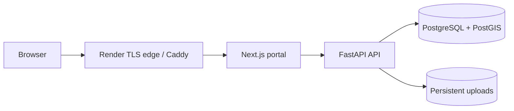

# InfraLink — Public Works Transparency Demo

InfraLink publishes public infrastructure works, schedules, progress, disruptions, maps, and resident feedback for a demo city. The demo runs with `DEV_MODE=true` so presenters can use the visible **Demo mode** banner and `/api/v1/dev/advance-time`; do not use this configuration for real public data.

## Run locally

Copy `.env.example` to `.env`, then run `docker compose up --build` and `make seed`. Open `http://localhost:3000`; API docs are at `http://localhost:8000/docs`. For the production-like Caddy stack, set strong secrets and `CORS_ORIGINS` in `.env`, then run `make prod-up`. Set `SITE_ADDRESS=your.domain` for Caddy-managed HTTPS, or leave `:80` for plain HTTP demo use. See [DEPLOYMENT.md](DEPLOYMENT.md) for Render setup, environment variables, backups, and reset.

## Demo accounts

- Staff: `admin@demo.city` (or `je.ward1@demo.city`, `commissioner@demo.city`); password `demo1234`.
- Resident: request an OTP for `9000000001`–`9000000005`; demo OTP is `123456`.
- Demo credentials and OTP are intentionally predictable. Keep the app on demo data and restrict access if presenting privately.

## Architecture

## Module ownership

| Owner | Modules / areas |
| --- | --- |
| Ambadas | Core, organisations, project registry, schedule/milestones, audit, admin/config, imports/seed; staff works/import/audit and field PWA |
| Aayushya | Geo-spatial, permits, conflict engine, evidence, feedback, notifications, reporting, open data; staff conflicts and related workflows |
| Hitesh | Resident portal, shared UI components, frontend API client, and translations |

## Handy commands

`make seed` seeds demo accounts and works; `make demo-reset` restores seed data; `make backup` writes a custom-format database dump; `make test` runs backend tests.
